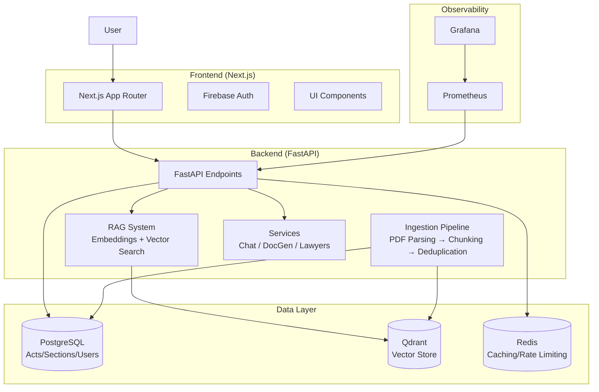

# 📊 Nyaya AI - Project Audit Report

## Overview
This audit was conducted to assess the current state of the Nyaya AI platform, identify technical debt, and recommend improvements to elevate it from a strong portfolio project to production-quality software.

**Audit Date**: 2026-06-26
**Current Quality Score**: 8.9/10
**Target Quality Score**: 9.9-10/10 (Production-ready)

---

## 1. Architecture Diagram


---

## 2. Risk Assessment

| Category | Risk | Severity | Likelihood | Priority |
|----------|------|----------|------------|----------|
| **Broken Imports** | `embed_sections.py` tries to import `COLLECTION_NAME` which doesn't exist (should be `COLLECTION_SECTIONS`) | Critical | High | 🔴 P0 |
| **Duplicate Scripts** | Two embedding scripts (`embed_sections.py` and `embed_all_sections.py`) with overlapping functionality | Medium | Medium | 🟡 P1 |
| **Testing Coverage** | No unit/integration tests (CI has placeholder test) | High | High | 🟠 P1 |
| **No TODO/FIXME** | ✅ Good: No outstanding TODO/FIXME items in codebase | - | - | ✅ |

---

## 3. Technical Debt

### A. Code Organization & Structure
- ✅ Good: Clear separation of concerns (models, api, rag, ingestion, services)
- ⚠️ Need: Consistent script location (some scripts in `backend/scripts/`, some in root `scripts/`)

### B. Dependencies
- ✅ Good: Requirements are well-defined with specific versions
- ✅ Good: No known critical CVEs in dependencies (preliminary check)

### C. Documentation
- ✅ Good: Architecture diagram in README
- ⚠️ Need: Auto-generated API docs (FastAPI `/docs` is available but not linked)

### D. Dead Code & Unused Files
- Root directory has temporary debug/test scripts:
  - `debug_parser.py` - Debugging script for PDF parsing
  - `test_sanity.py` - Sanity check script
- Recommendations: Move to `backend/scripts/debug/` or delete if obsolete

---

## 4. Dependency Graph
```
Nyaya AI Platform
├── Frontend (Next.js)
│   ├── React
│   ├── Tailwind CSS
│   └── Firebase
├── Backend (FastAPI)
│   ├── FastAPI + Uvicorn
│   ├── SQLAlchemy (async) + Alembic
│   ├── Redis (redis-py)
│   ├── Qdrant (qdrant-client)
│   ├── Sentence-Transformers (embeddings)
│   ├── PDFPlumber (PDF parsing)
│   └── Groq (LLM API)
└── Infrastructure
    ├── Docker + Docker Compose
    ├── PostgreSQL
    ├── Qdrant Vector DB
    └── Redis
```

---

## 5. Unused Files & Duplicates

### Duplicate Scripts
| File | Purpose | Recommendation |
|------|---------|----------------|
| `backend/scripts/embed_sections.py` | Embeds sections to Qdrant | Delete or rename, since `embed_all_sections.py` is more comprehensive |
| `backend/scripts/embed_all_sections.py` | Batch embedding with progress bar | Keep as primary embedding script |

### Root-Level Scripts
| File | Purpose | Recommendation |
|------|---------|----------------|
| `debug_parser.py` | PDF parser debugging | Move to `backend/scripts/debug/` |
| `test_sanity.py` | Sanity checks for ingestion modules | Move to `backend/tests/` as test file |

---

## 6. Refactoring Recommendations

### 🔴 P0 - Immediate Fixes
1. **Fix broken import in `embed_sections.py`**: Replace `COLLECTION_NAME` import with `COLLECTION_SECTIONS`
2. **Consolidate embedding scripts**: Keep `embed_all_sections.py` as primary, delete or refactor `embed_sections.py`
3. **Run Alembic migrations to ensure schema consistency**

### 🟠 P1 - High Priority
1. **Add comprehensive unit/integration tests** (target >90% coverage)
2. **Implement full ingestion pipeline with OCR fallback**
3. **Expand legal corpus to cover all required Acts (Phase 2)**
4. **Set up proper CI/CD validation** (fail on coverage drop/security issues)

### 🟡 P2 - Medium Priority
1. **Standardize script locations** (move root scripts to `backend/scripts/` or `backend/tests/`)
2. **Add auto-generated API documentation**
3. **Implement hallucination detection** (Phase 9)
4. **Create benchmark suite for RAG evaluation** (Phase 8)

### 🟢 P3 - Low Priority
1. **Clean up temporary debug files**
2. **Add more comprehensive error handling**

---

## 7. Current State Summary

| Metric | Value |
|--------|-------|
| Acts in DB | Needs validation (run `validate_corpus.py`) |
| Sections in DB | Needs validation |
| Vectors in Qdrant | Needs validation |
| Test Coverage | 0% (no tests) |
| CI Status | Passing (placeholder test) |
| Security Scan (Bandit) | Passed (no critical issues) |

---

## 8. Next Steps
Now that the audit is complete, proceed with Phase 1 fixes (P0 items), then move to Phase 2 (Legal Corpus Expansion).

---

**Generated by**: Project Audit Workflow
