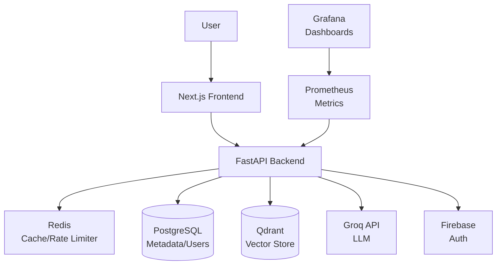

# Nyaya Legal Platform 🏛️

Nyaya is a production-grade, AI-powered legal research and assistant platform designed for the Indian legal context. It uses a sophisticated RAG (Retrieval-Augmented Generation) stack to provide grounded, verifiable legal information across various Indian Acts.

## 🚀 Core Features

- **AI Legal Assistant:** Real-time chat with streaming responses, grounded in verifiable legal sections.
- **Semantic Search:** Advanced vector search across 200+ sections (BNS, IT Act, POCSO, RTI, etc.) using `BAAI/bge-m3`.
- **Bilingual Support:** Fully localized experience in **Hindi** and **English**.
- **Legal Document Generator:** AI-powered drafting for FIRs, RTI applications, and Consumer Complaints.
- **Verified Lawyer Directory:** Connect with legal experts based on specialization and location.
- **Secure Dashboard:** Firebase-authenticated personal space for saving queries and bookmarked sections.
- **Analytics Hub:** Admin dashboard for monitoring system usage and legal query trends.

## 🏗️ System Architecture



## 🛠️ Technology Stack

- **Frontend:** Next.js (App Router), Tailwind CSS, Lucide Icons, Firebase SDK.
- **Backend:** FastAPI, SQLAlchemy, Firebase Admin SDK.
- **Vector Database:** Qdrant (Semantic indexing).
- **Relational Database:** PostgreSQL (Metadata & User state).
- **Caching/Queuing:** Redis (Session management & Rate limiting).
- **AI Models:** Groq (LLM), HuggingFace `bge-m3` (Embeddings).
- **Monitoring:** Prometheus, Grafana.

## 📊 Validation & CI/CD

- **Automated Validation:** Run `python scripts/validate.py` to generate validation reports.
- **RAG Evaluation:** Run `python scripts/rag_eval.py` to benchmark retrieval quality.
- **CI/CD:** GitHub Actions automatically runs linting, security scanning, and testing on every push.

## 📦 Deployment & Setup

### 1. Environment Configuration
Ensure your `.env` (root) and `frontend/.env.local` are populated with:
- **Groq API Key**
- **Firebase Admin/Client Credentials**
- **Database URLs**

### 2. Launch with Docker
```bash
# Start all services
docker compose up -d --build
```

### 3. Initialize Data
```bash
# Seed the legal corpus
docker compose run --rm api python scripts/seed_corpus_v2.py

# Index sections for vector search
docker compose run --rm api python scripts/embed_sections.py
```

### 4. Access the Platform
- **Frontend:** [http://localhost:3000](http://localhost:3000)
- **API Docs:** [http://localhost:8000/docs](http://localhost:8000/docs)
- **Monitoring:** [http://localhost:3001](http://localhost:3001) (Grafana)

## ⚖️ Legal Disclaimer
Nyaya is an AI assistant and does not provide professional legal advice. Users should always consult with a qualified advocate for legal matters.

---
*Developed for professional legal research and empowerment.*
